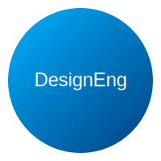

# 🚀 Welcome to DesignEng

**DesignEng** is a cutting-edge open-source organization focused on **automating mechanical engineering through technology**. We're building the future where complex mechanical workflows become seamless, automated processes.

---

## � Our Mission
**Automate Mech using Tech** - We believe in harnessing the power of automation to revolutionize mechanical engineering workflows. Our goal is to eliminate repetitive tasks, enhance precision, and accelerate innovation in mechanical design and analysis.

## 🌟 Our Vision
To create a world where mechanical engineers can focus on innovation and creativity while technology handles the repetitive and computational heavy lifting.

---

## 🚧 Current Flagship Project: FreeCAD Automation

We're currently working on automating **FreeCAD** - one of the most popular open-source parametric 3D modelers. Our goal is to create intelligent automation tools that can:

- **Automate repetitive design tasks**
- **Generate parametric models programmatically**
- **Streamline simulation workflows**
- **Create intelligent design assistants**

### 🔧 FreeCAD Automation Features
- Python scripting automation
- Batch processing capabilities
- Intelligent part generation
- Automated assembly workflows
- Integration with external CAE tools

---

## 🌍 Open-Source Projects

We believe in the power of open-source. Explore our projects, contribute your ideas, and be part of a global movement to create impactful solutions. Every contribution, no matter how small, makes a difference.

### ⭐ Why Contribute?

- Collaborate with a vibrant community of engineers and developers.
- Learn and grow by working on cutting-edge projects.
- Gain recognition for your contributions.
- Help shape the future of automated mechanical engineering.

### 🔧 How to Get Started

1. Browse our [repositories](https://github.com/orgs/DesignEng/repositories).
2. Check out our [Contributing Guidelines](./CONTRIBUTING.md).
3. Pick an issue labeled `good-first-issue` or `help-wanted`.
4. Fork the repository of your choice.
5. Make your changes and submit a pull request.

### 📋 Ways to Contribute

- **Code**: Help develop automation tools and scripts
- **Documentation**: Improve guides and tutorials
- **Testing**: Test new features and report bugs
- **Ideas**: Suggest new automation workflows
- **Community**: Help others in discussions and issues

---

## 📊 Project Stats

---

## 🏆 Recognition & Achievements

- Growing community of mechanical engineering automation enthusiasts
- Active development of FreeCAD automation tools
- Open-source contributions to the mechanical engineering ecosystem

---

## 📚 Resources

- **[Documentation](./docs/README.md)** - Comprehensive guides and tutorials
- **[Wiki](https://github.com/DesignEng/wiki)** - Community knowledge base
- **[Roadmap](./ROADMAP.md)** - Our development plans and milestones
- **[Code of Conduct](./CODE_OF_CONDUCT.md)** - Community guidelines

---

## 🤝 Join Us

We are always looking for passionate individuals to join our journey. Whether you're a mechanical engineer, software developer, or automation enthusiast, there's a place for you at DesignEng.

### 📬 Contact Us

Have questions or ideas? Reach out to us:

- **Email:** contact@designeng.org
- **Twitter:** [@DesignEng](https://twitter.com/DesignEng)
- **LinkedIn:** [DesignEng](https://linkedin.com/company/designeng)
- **Discord:** [Join our community](https://discord.gg/designeng)

---

## 🛡️ License

This organization and its projects are licensed under the [MIT License](./LICENSE) - see individual repositories for specific licensing information.

---

## 🙏 Acknowledgments

- Thanks to all our [contributors](https://github.com/orgs/DesignEng/people)
- Special thanks to the FreeCAD community
- Inspired by the open-source mechanical engineering community

---

*Together, let's automate the future of mechanical engineering.*